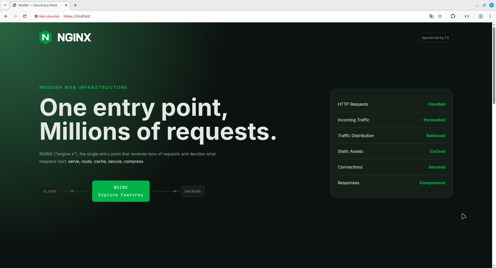

# Discovering how to configure NGINX

A project exploring the main roles that **NGINX** can play:

- **Web server** — serves static files
- **Reverse proxy** — hides the backends behind a single entry point
- **Load balancer** — spreads traffic across several identical instances
- **Cache manager** — stores backend responses to avoid hitting them every time
- **Traffic compressor** — gzip compression of text responses
- **Secure entrypoint** — HTTPS termination

---

## Full explainations on my notes here:

[NGINX configuration](https://twn-devops-notes.super.site/nginx-proxy-web-server)

---

## Architecture

A single NGINX instance sits in front of **three identical containers** running the
same **Express app** that shows a **web page** presenting the main **features of Nginx**.

NGINX :
- terminates TLS,
- compresses responses,
- caches them,
- and load-balances incoming requests across the three backends.

```
                          ┌──────────────────────────────┐
                          │            NGINX             │
   Browser  ── :443 ───▶  │  TLS · gzip · cache · proxy  │
            (HTTP→HTTPS)  │        load balancer         │
                          └───────────────┬──────────────┘
                                          │  least_conn
                 ┌────────────────────────┼────────────────────────┐
                 ▼                        ▼                        ▼
          webapp1 :3001            webapp2 :3002            webapp3 :3003
          (Express, Docker)        (Express, Docker)        (Express, Docker)
```

---

## Project structure

```
.
├── README.md
├── logo/                     # source logos illustrating each NGINX role
└── webapp/
    ├── Dockerfile            # builds the Node.js image
    ├── docker-compose.yaml   # runs 3 instances of the same image
    ├── package.json
    ├── package-lock.json
    ├── server.js             # Express server (reads APP_NAME / HOST_PORT)
    └── public/               # static files served by Express
        ├── index.html
        ├── style.css
        ├── script.js
        └── images/
```

---

## Preview


---

## Prerequisites

- **Docker** and **Docker Compose**
- **NGINX** installed on the host (`sudo apt install nginx` on Debian/Ubuntu/Mint)

---

## Getting started

## 1. Clone this repository

```bash
git clone git@github.com:DevCTx/Nginx.git
```

### 2. Build and run the three web app instances

```bash
cd webapp
docker compose up --build
```

A single image is built once and reused by all three services. Each container
receives a different `APP_NAME` and `HOST_PORT` via environment variables and is
published on a distinct host port:

| Service  | Container port | Host port |
|----------|----------------|-----------|
| webapp1  | 3000           | 3001      |
| webapp2  | 3000           | 3002      |
| webapp3  | 3000           | 3003      |

You can verify each instance directly: http://localhost:3001, `:3002`, `:3003`.

### 3. Configure NGINX

Copy the site configuration into `/etc/nginx/sites-available/webapp`, enable it,
and disable the default site to free port 80/8080:

```bash
sudo ln -s /etc/nginx/sites-available/webapp /etc/nginx/sites-enabled/
sudo rm -f /etc/nginx/sites-enabled/default
sudo mkdir -p /var/cache/nginx/webapp
sudo nginx -t
sudo systemctl reload nginx
```

### 4. Open the app through NGINX
http://localhost:8080 (or https://localhost once TLS is configured).


### 5. When you are done

```bash
docker compose down
```
and delete folder

---

## Submodule of DevOps Repository

> This repository is used as a **submodule** in **PART2-Fundamentals** of my **DevOps** repository:
> https://github.com/DevCTx/DevOps
